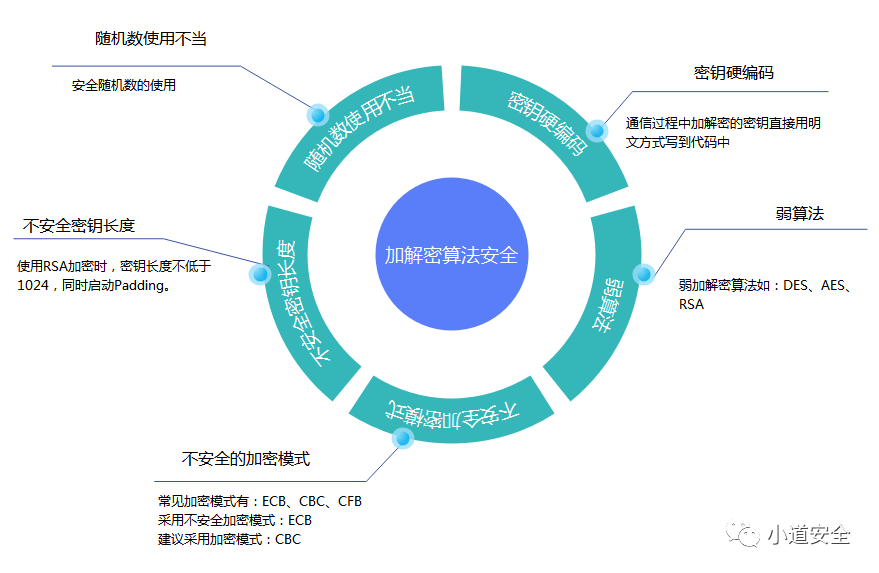

> 本文适合大概了解常见加密算法，以备逆向时快速确定加密方式。基本Android逆向时常见的就是RSA和AES CBC，想要解密出明文，除了密钥外，还需要知道padding模式，等

首先介绍下padding

# Padding

在书面语中，明文经常以可预测的方式开始和结束。例如：尊敬的、此敬等等。为了防止已知明文攻击，随机长度的填充来防止攻击者知道明文的长度。

分为以下几种：PKCS5（**openssl分组密码默认**），PKCS7，NOPADDING，Zero padding，ISO 10126 ， ANSI X.923

# 常见词：

- S盒——(Substitution-box)是对称密钥算法执行置换计算的基本结构，S盒的功能就是一种简单的“代替”操作
- PKCS——（Public Key Cryptography Standards）

# 非对称

## RSA

- 密钥长度目前有1024、2048、3072、4096bits，密文长度和密钥长度相等
- 实际可加密的明文长度最大也是1024bits，而且只要用到padding，就要占用实际的明文长度。PKCS#1建议的padding就占用了11个字节，所以实际明文117字节

## ECC

椭圆曲线密码（Elliptic Curves Cryptography）

# 对称

## 分组密码

### DES

数据加密标准（Data Encryption Standard）

- 密钥56位
- 数据64位

### AES

高级加密标准（Advanced Encryption Standard），数据量大可以选择。有AES128，192，256

- 密钥的长度可以使用128位、192位或256位。密钥的长度不同，推荐加密轮数也不同
- 加密的数据块，IV都和密钥长度相同
- 如果数据块,IV及密钥长度不足时会补齐

#### AES模式

##### CBC

Cipher-block Chaining，该模式使用了IV更安全常用

- IV(Initialization Vector)，解密该模式不仅需要密钥key，还需要IV值

Refer

[[1\]十分钟读懂AES加密算法_Lee.rw的博客-CSDN博客_aes加密](https://blog.csdn.net/lrwwll/article/details/78069013)