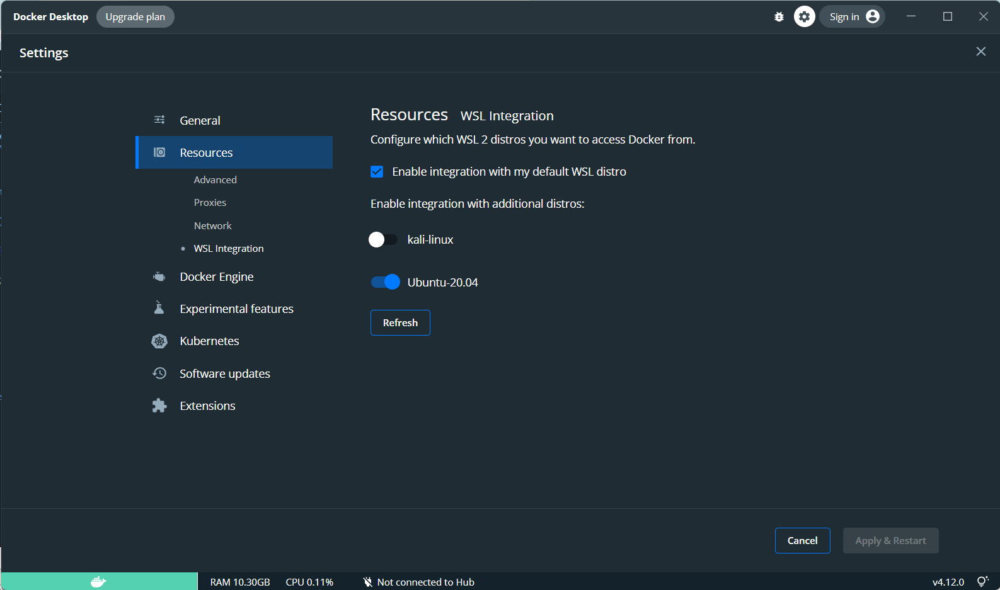

wsl2上运行`docker run helloworld`报错：

> Cannot connect to the Docker daemon at unix:///var/run/docker.sock. Is the docker daemon running?

原因是wsl2上没有systemd，需要安装docker for windows

环境：

- wsl2
- Ubuntu-20.04
- windows11 家庭版

# Steps

1. 如果使用的是wsl1，需要升级到wsl2
2. 安装[Docker Desktop for Windows.](https://docs.docker.com/desktop/windows/wsl/#download)
3. 打开以下设置就OK了

Ref:

- https://stackoverflow.com/a/61640711
- [Docker Desktop WSL 2 backend——Docker Documentation](https://docs.docker.com/desktop/windows/wsl/)